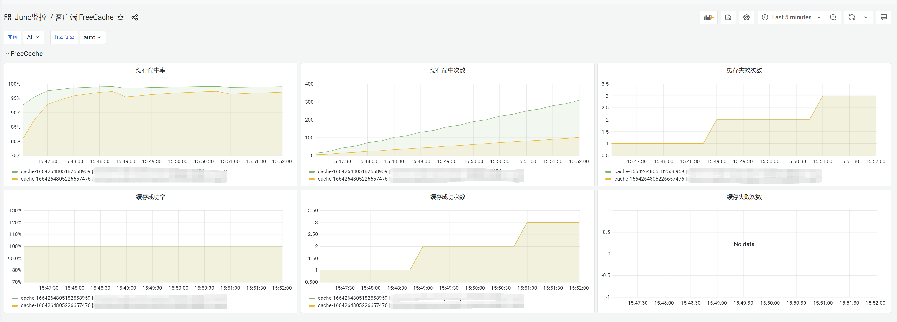

# 4.9 调用本地缓存

## 4.9.1 简介
pkg/cache 包支持多个本地缓存库，并支持metric上报

### 1 支持的本地缓存库
|     描述     |                               库地址                                |
|:----------:|:----------------------------------------------------------------:|
| freecache库 | [github.com/coocood/freecache](https://github.com/coocood/freecache)   |
| golang-lru库 | [github.com/hnlq715/golang-lru](https://github.com/hnlq715/golang-lru)   |

### 2 freecache配置规范
```toml
[jupiter.cache]
    # freecache本地缓存总容量 默认256MB 
    # 缓存value的大小需要小于缓存总容量的1/1024，否则无法存入到本地缓存中
    # 可支持单位: B或Btye、KB、MB、GB、TB (大小写均支持)
    size = "256MB" # 【可选】
[jupiter.cache.student]
    expire = "2m" # 【必填】本地缓存失效时间
    disableMetric = false # 【可选】是否禁用metric上报 false 开启  ture 关闭  默认开启上报
```

#### freecache特性与使用注意事项
**特性**：
- 可存储数以百万计条目
- 零垃圾收集负荷
- 高并发而且线程安全的访问
- 纯 Go 语言实现
- 支持对象失效
- 近乎 LRU 的算法
- 严格限制内存使用

**使用注意事项**：
- **缓存key的大小需要小于65535，否则无法存入到本地缓存中**（The key is larger than 65535）
- **缓存value的大小需要小于缓存总容量的1/1024，否则无法存入到本地缓存中**（The entry size need less than 1/1024 of cache size）

### 3 golang-lru配置规范
```toml
[jupiter.xgolanglru]
    # golang-lru 每个配置都会新增一个实例
[jupiter.xgolanglru.student]
    expire = "2m" # 【必填】本地缓存失效时间
    size = 200000 # 【可选】
    disableMetric = false # 【可选】是否禁用metric上报 false 开启  ture 关闭  默认开启上报
```


## 4.9.2 使用方法
### 1 前言
需要使用golang-lru库只需要将包名从`github.com/douyu/jupiter/pkg/cache/xfreecache/v2`换成`github.com/douyu/jupiter/pkg/cache/xgolanglru`即可，juno配置项换成golang-lru配置规范

### 2 初始化实例
```go
import (
	"github.com/douyu/jupiter/pkg/cache"
    "github.com/douyu/jupiter/pkg/cache/xfreecache/v2"
)

type Student struct {
    Age  int
    Name string
}

type Instance struct {
	localCache *cache.Cache[string, Student]
}

func NewInstance() *Instance {
	return &Instance{
		localCache: xfreecache.StdNew[string, Student]("student"),
	}
}
```
- 若juno中无配置时，会初始化一个默认配置。默认配置详情：缓存容量：`256MB`（缓存value需要小于256KB）   失效时间：`2分钟`  是否开启metric上报：`是`
- 初始化多个配置时，内部只会初始化一个缓存容量为256MB的缓存实例。无需担心初始化多个实例后的缓存消耗

### 3 函数方法介绍
```go
// GetAndSetCacheData 获取缓存后数据（内部已封装设置和获取本地缓存操作）【推荐使用】
// key 缓存key
// id 索引（无作用，会组装到key里面）
// fn 获取返回数据需要执行的方法
// value 
// err fn返回的错误以及其他报错
func (c *cache[K, V]) GetAndSetCacheData(key string, id K, fn func() (V, error)) (value V, err error)

// GetCacheValue 获取缓存数据
// key 缓存key
// id 索引（无作用，会组装到key里面）
// value 
func (c *cache[K, V]) GetCacheValue(key string, id K) (value V)

// SetCacheValue 设置缓存数据
// key 缓存key
// id 索引（无作用，会组装到key里面）
// fn 获取返回数据需要执行的方法
// err fn返回的错误以及其他报错
func (c *cache[K, V]) SetCacheValue(key string, id K, fn func() (V, error)) (err error)

// GetAndSetCacheMap 获取缓存后数据 map形式 【推荐使用】
// key 缓存key
// ids 返回map中的key集合
// fn 获取返回数据需要执行的方法
// value 
// err fn返回的错误以及其他报错
func (c *cache[K, V]) GetAndSetCacheMap(key string, ids []K, fn func([]K) (map[K]V, error)) (v map[K]V, err error)

// GetCacheMap 获取缓存数据 map形式
// key 缓存key
// ids 返回map中的key集合
// value 
func (c *cache[K, V]) GetCacheMap(key string, ids []K) (v map[K]V)

// SetCacheMap 设置缓存数据 map形式
// key 缓存key
// ids 返回map中的key集合
// fn 获取返回数据需要执行的方法
// err fn返回的错误以及其他报错
func (c *cache[K, V]) SetCacheMap(key string, ids []K, fn func([]K) (map[K]V, error)) (err error)

```


### 4 实际案例
配置项
```toml
[jupiter.cache.bwlist]
    expire = "1m" # 本地缓存失效时间
```

代码
```go
package bwlist

import (
	"context"
	"github.com/zhengyansheng/jupiter/pkg/cache"
	"github.com/zhengyansheng/jupiter/pkg/cache/xfreecache/v2"
)

type Instance struct {
	localCache *cache.Cache[int32, []int32]
}

func NewInstance() *Instance {
	return &Instance{
		localCache: xfreecache.StdNew[int32, []int32]("bwlist"),
	}
}

// GetBWListCached 获取单个白名单配置-带1min本地缓存
// id 白名单配置id
func (i *Instance) GetBWListCached(ctx context.Context, id int32) (res []int32, err error) {
	res, err = i.localCache.GetAndSetCacheData("bwlist.GetBWList", id, func() ([]int32, error) {
		data, innerErr := i.GetBWList(ctx, id)
		return data, innerErr
	})
	return
}

// BatchGetBWListCached 批量获取白名单配置-带1min本地缓存
// ids 多个白名单配置id
func (i *Instance) BatchGetBWListCached(ctx context.Context, ids []int32) (res map[int32][]int32, err error) {
	res, err = i.localCache.GetAndSetCacheMap("bwlist.GetBWList", ids, func(innerIds []int32) (map[int32][]int32, error) {
		data, innerErr := i.BatchGetBWList(ctx, innerIds)
		return data, innerErr
	})
	return
}

// GetBWList 获取单个白名单配置-不带缓存
// id 白名单配置id
func (i *Instance) GetBWList(ctx context.Context, id int32) (res []int32, err error) {
	// TODO 可以根据实际业务具体实现方法
	return
}

// BatchGetBWList 批量获取白名单配置-不带缓存
// ids 多个白名单配置id
func (i *Instance) BatchGetBWList(ctx context.Context, id []int32) (res map[int32][]int32, err error) {
	// TODO 可以根据实际业务具体实现方法
	return
}
```

## 4.9.3 juno监控



